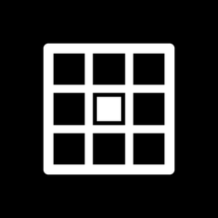

# BrightSudoku

Sudoku for the Light Phone III. Every puzzle is made on the phone, proven to have
one answer, and proven to need no guessing. A LightOS tool built on the official
[light-sdk](https://github.com/lightphone/light-sdk) with Kotlin, Jetpack Compose,
`LightScreen` and `LightViewModel`, themed with `sdk:ui`.

## Install via BrightMarket

<p align="center">
  
</p>

Scan the code above with **BrightMarket** installed to open BrightSudoku there and
install or update it directly. Don't have BrightMarket yet? Get it, and browse
every Bright app, at
**[brightmarket.gzl.dev](https://brightmarket.gzl.dev)**.

[Download the latest APK](https://github.com/gi-os/BrightSudoku/releases/latest). See
[INSTALL.md](INSTALL.md).

Part of the [Bright* collection](https://brightmarket.gzl.dev).

## Two promises

Most Sudoku apps ship puzzles with one answer. That is the easy half, and on its
own it is not enough: a puzzle can have exactly one answer and still be
findable only by trying a digit, following it for twenty moves and backing out.
Handing someone that on a phone, on a bus, is a small act of hostility.

So every puzzle here passes two separate tests before it is dealt, and the tests
are the app rather than a claim about it.

1. **Exactly one answer**, counted rather than assumed. After every clue the
   generator takes away, it counts the solutions with a bound of two. If the
   count is not one, the clue goes straight back.
2. **Solvable by reasoning**, proven by finishing it. A solver that never
   guesses has to complete the grid using the techniques listed below. If it
   stalls, the puzzle is thrown away — however elegant the layout, however
   unique the answer.

Nothing in the app ever needs the second test to be taken on trust: `Hint` runs
the same solver on the board in front of you, so if it can be finished by
reasoning, the app can always show you the next piece of it.

## Difficulty is a technique, not a clue count

Clue count is what most apps show and it is close to meaningless. Measured here
over 640 layouts, hidden singles alone finish most grids right down to 24 clues,
while a 32-clue grid occasionally needs an x-wing. Difficulty is a property of the
reasoning a puzzle demands, not of how much was taken away.

So a puzzle is graded by the hardest technique it cannot avoid, and each grade is
a band — it needs its own technique somewhere, and nothing harder anywhere.

| Grade | Needs | And never needs |
| --- | --- | --- |
| **Gentle** | Naked and hidden singles | Anything else |
| **Steady** | A digit pinned to a line inside a box, or to a box inside a line | Subsets |
| **Tricky** | A naked or hidden pair or triple | Wings and fish |
| **Severe** | An x-wing, an xy-wing or a swordfish | Anything a person would call a chain |

The ladder is in
[`Solver.kt`](tool/src/main/kotlin/com/gios/brightsudoku/game/Solver.kt), and the
solver always takes the cheapest step available. That is what makes a grade mean
something: a puzzle is only called Severe if the hard step was genuinely
unavoidable at the point it was needed, not merely one of several ways forward.

Adding a technique to that ladder therefore makes some existing puzzles easier,
which is why the generator carries an algorithm version — a seed is the only
place a puzzle is stored, and changing the ladder changes what a seed means.

## How a puzzle gets made

Digging clues out to a fixed count and hoping is the obvious approach, and it does
not work. It produces Gentle puzzles almost whatever you ask for, and the hardest
grades essentially never appear at all: across those same 640 layouts, not one
came out needing an x-wing.

So each layout is dug as far as it will go, and then walked back up. Restoring a
clue can only make a puzzle easier, so putting them back a pair at a time steps
down through the grades, and the walk stops on the one that was asked for. A
layout becomes a whole spectrum of puzzles rather than one sample from it, which
is what makes the harder grades reachable.

Two details make it affordable on a phone. Clues come out in rotationally
symmetric pairs, so one uniqueness check buys two of them — and the traditional
symmetric look comes free. And each grading pass is capped at its own grade's
hardest technique, so proving a position *too hard* costs the cheap rungs of the
ladder and never runs the expensive fish and wing searches at all.

Measured on a desktop JVM, per seed, including the attempts that come to nothing:

| Grade | Time | Seeds that yield this grade |
| --- | --- | --- |
| Gentle | under 3 ms | all of them |
| Steady | ~15 ms | about 4 in 5 |
| Tricky | ~55 ms | about 2 in 3 |
| Severe | ~50 ms | about 4 in 5 |

The phone is a long way slower than a desktop JVM, which is why generation runs
off the main thread behind a **Making a puzzle** message rather than blocking the
screen. **New puzzle** walks up to eight consecutive seeds, so a grade that this
seed cannot produce is invisible: the next one can, and a seed costs nothing.
Typing a seed is different — you asked for *that* puzzle — so that path walks the
grades instead, and labels the board with the grade it actually got.

## Reading the board

The panel is black and white, so weight carries what colour would elsewhere.

- **Clues** are drawn bold. They cannot be changed.
- **Your digits** are drawn regular.
- **Pencil marks** sit in a three by three inside the square, each digit always in
  the same corner, so the pattern can be read without reading the numbers.
- **The selected square** is inverted — solid, with the digit knocked out of it.
  On a one-bit panel an outline competes with the grid rules it sits on; a solid
  block never does.
- Squares that share a row, column or box with the selection take a faint wash,
  and squares holding the *same digit* as the selection take a stronger one. That
  pair is most of what makes scanning for a digit possible at this size.
- **A line under a digit means it is wrong.** One mark, whether it clashes with
  another digit or, with checking on, simply is not the answer — two different
  marks would be a legend to learn.

The whole thing follows the LightOS theme and flips with light and dark mode.

## Controls

| Action | What happens |
| --- | --- |
| Tap a square | Select it. Tap it again to drop the selection. |
| Tap a digit | Write it into the selected square. Tap the same digit again to rub it out. |
| Digits / Marks | One toggle. The label names the mode a tap will *use*, not the one it switches to. |
| Erase | Empty the selected square, marks and all |
| Home | Leave the puzzle. The board is already saved. |
| Undo | Remembers 120 moves |
| Hint | First press shows it. Second press carries it out. |

A digit that has been used all nine times is dimmed in the pad rather than removed
— a pad that changes shape as you play moves every other key under your thumb.

The board saves after every digit, so leaving and coming back drops you on the
same grid. A save that does not decode to a legal puzzle with a matching answer is
thrown away and you get a fresh one, rather than a board with no ending.

## Hints that say why

A hint that only says "put a 4 here" teaches nothing and is indistinguishable from
the app playing for you. So a hint draws what it is reasoning about — a frame
round the square it wants a digit in, a wash on the squares that force it, a tick
on squares it is ruling a digit out of — and says the reason in a line:

> 7 fits nowhere else in this box, so it goes here.

> Whichever way the marked pivot goes, one of its two partners takes 4 — so
> nothing that sees both can.

Only then does a second press play it. It always offers the easiest step
available; being shown an x-wing while a square three along has one candidate left
would be worse than no hint at all.

Hints reason about the board **as you left it**, not about the answer. So a board
with a wrong digit on it can run out of hints, and that is worth knowing: on a
puzzle this app dealt, no hint means something already written is wrong.

## Settings

**Tidy marks** (on) rubs a digit out of the pencil marks of every square that can
no longer hold it. Doing that by hand is the dull half of pencilled Sudoku. Off,
the marks are yours alone.

**Check as you go** (off) marks a written digit that is not the answer, the moment
it goes in. With it on you cannot go wrong, which is a different and much smaller
game — so it is a decision you make rather than a favour the app does. With it
off, only digits that clash with another digit are marked, which is true whatever
you think of it.

Nothing here keeps a timer or counts your mistakes. The board is not marking you.

## The wheel

The wheel is deliberately left alone on the board.

The SDK forwards a key it does not claim to LightOS, which reads a wheel turn as
brightness. The board has nothing to scroll — it is sized to fit the panel — so
claiming the wheel there would only mean brightness went dead the moment a puzzle
opened, which is the longest anyone looks at this screen and exactly when they
might want it dimmer. The menu and settings do scroll, and there the wheel scrolls
them. Same reasoning as
[BrightNonogram](https://github.com/gi-os/BrightNonogram), and the same wheel code.

## Layout of this repository

This is the light-sdk tree. The game lives in the `tool/` module that the SDK
reserves for exactly that. Everything else stays upstream and untouched, so a
rebase stays cheap.

| Path | What it is |
| --- | --- |
| `tool/src/main/kotlin/com/gios/brightsudoku/game/Sudoku.kt` | Geometry and candidate arithmetic. Units, peers, legality. |
| `tool/src/main/kotlin/com/gios/brightsudoku/game/Solver.kt` | Both solvers: the bounded search, and the technique ladder that never guesses |
| `tool/src/main/kotlin/com/gios/brightsudoku/game/Difficulty.kt` | What each grade means, as a band of techniques |
| `tool/src/main/kotlin/com/gios/brightsudoku/game/Board.kt` | Play state: digits, pencil marks, undo, clashes |
| `tool/src/main/kotlin/com/gios/brightsudoku/game/SaveState.kt` | One-line encoding of a game in progress |
| `tool/src/main/kotlin/com/gios/brightsudoku/gen/Generate.kt` | Dig, then walk back up to the grade that was asked for |
| `tool/src/main/kotlin/com/gios/brightsudoku/ui/SudokuGrid.kt` | The board, drawn into one canvas with cached glyphs |
| `tool/src/main/kotlin/com/gios/brightsudoku/HomeScreen.kt` | `@InitialScreen`, view model, menu, board, settings |
| `tool/src/main/kotlin/com/gios/brightsudoku/data/SudokuStore.kt` | DataStore read and write |
| `tool/src/main/kotlin/com/gios/brightsudoku/hw/` | The brightness wheel, as a scroll source |
| `tool/src/test/kotlin/com/gios/brightsudoku/` | JVM unit tests, which CI runs before it builds anything |
| `tool/lighttool.toml` | Tool identity and version. The release workflow checks the tag against it. |
| `tool/src/main/res/drawable/loading_text_icon.xml` | The mark, which overrides the SDK splash drawable of the same name |
| `tools/generate_icon.py` | Builds the mark and `assets/icon.png`. Stdlib only. |
| `sdk/`, `plugin/`, `examples/`, `docs/` | Upstream light-sdk |

## Build

```sh
git clone https://github.com/gi-os/BrightSudoku.git
cd BrightSudoku
./gradlew :tool:testDebugUnitTest :tool:assembleDebug
```

This repo vendors the SDK, so the build resolves nothing from GitHub Packages
except the SDK's keyboard dependency — see [INSTALL.md](INSTALL.md) for the token.

To run against the LightOS emulator, set
`serverPackage = "com.thelightphone.sdk.emulator"` in `tool/lighttool.toml`. Set it
back to `com.lightos` before a device build.

## The mark

LightOS has no launcher icon. The toolbox lists tools by name, nothing in the SDK
or the emulator ever calls `loadIcon`, and the SDK generates the manifest itself
with no `android:icon` in it.

The splash is the one place a tool can show a mark of its own. `sdk:client` ships a
drawable named `loading_text_icon`, the "loading..." wordmark. Resources in the
application module take precedence over resources from a library module, so
`tool/src/main/res/drawable/loading_text_icon.xml` replaces it with no manifest
change and no rule bent.

The rest of the collection draws the first letter of the tool's name.
This one cannot: BrightSolitaire already has the S, and two tools in the same
toolbox showing the same letter is worse than no letter at all. So the mark is
what the tool is — a three by three grid with one square filled. That needs no
font, which is why `tools/generate_icon.py` has no dependencies: it writes both the
vector drawable and the PNG on this page from one description of the geometry,
using nothing but the standard library.

```sh
python3 tools/generate_icon.py
```

## Tests

The rules, the solvers and the generator carry no Android dependency, so all of
this runs as a JVM unit test — and CI fails the build if an `android.` import
appears in either package, because that separation is what makes the promises at
the top of this page testable at all. No APK is built until 46 tests pass.

`SolverTest` checks the geometry itself (27 units, 20 peers per square), counts a
known puzzle's solutions against its known answer, and builds positions where one
technique is the only thing available. Then two stronger checks. Every step the
solver proposes is compared against the answer — a placement must be the true
digit, and an elimination must never strike the true digit out. And the two
solvers are run against each other on every generated puzzle: the backtracking
search and the ladder that never guesses have to reach the same grid, every time.
If they ever disagreed, one of them would be unsound and the app could not tell
which.

`GenerateTest` re-proves both promises against every puzzle the suite produces
rather than a sample of them: exactly one solution, counted; finished by logic,
with the reasoning ending on the same answer. It also checks the grade sits inside
its band on *both* sides — the floor is what stops every grade quietly collapsing
into Gentle, which is exactly what an earlier version of this generator did — that
a seed always deals the same puzzle, that different seeds differ, that the clue
layout really is symmetric, and that **New** can always produce every grade.

`BoardTest` covers writing, erasing, pencil marks, clashes, and the awkward one:
that undo restores the marks auto-tidy rubbed out, not just the digit that rubbed
them out. It also plays a whole puzzle by following hints, which is the end-to-end
check that a board dealt by this app can always be finished by the reasoning it
offers.

`SaveStateTest` round-trips a fresh board, one in progress and a finished one, at
full pencil-mark density. Then a dozen kinds of damage — truncated, wrong version,
letters in the grid, unknown grade, bad base64 — must all decode to nothing. So
must the two corruptions that would otherwise be playable: clues that repeat a
digit in a unit, and an answer that does not answer its own clues.

## Origin and credits

- **[lightphone/light-sdk](https://github.com/lightphone/light-sdk)** by The Light
  Phone is the base of this repository. This repo vendors the whole tree. The SDK
  client, the UI kit, the Gradle plugin, the lint rules and the builder are their
  work, released under MIT before the platform was even public. Thank you.
- **[gi-os/BrightNonogram](https://github.com/gi-os/BrightNonogram)** set the
  pattern this one follows: a puzzle generator that ships nothing it cannot prove
  is fair, one screen rather than a back stack, and the wheel handling, which is
  taken across unchanged.
- **[gi-os/BrightSolitaire](https://github.com/gi-os/BrightSolitaire)** is where
  the ranked, explained hints and the honest "here is what I can and cannot prove"
  stance come from.
- Sudoku itself belongs to nobody. The rules here are the standard 9×9.


## License

MIT, the same as upstream light-sdk. See [LICENSE](LICENSE).

<!-- bright-footer:begin -->
---

## Bright\*

*Every puzzle generated on-device and proven to have one answer and to need no guessing.*

26 open-source apps for the **Light Phone III** — camera, music, maps, messages,
reading, transit, games. The phone has no app store, so they install by sideload: scan one
code from **[brightmarket.gzl.dev](https://brightmarket.gzl.dev)** and BrightMarket keeps them updated.

[Roll](https://github.com/gi-os/Roll) · [BrightMusic](https://github.com/gi-os/BrightMusic) · [BrightWay](https://github.com/gi-os/BrightWay) · [BrightChat](https://github.com/gi-os/BrightChat) · [BrightControl](https://github.com/gi-os/BrightControl) · [BrightRemote](https://github.com/gi-os/BrightRemote) · [browse all 26 →](https://brightmarket.gzl.dev)

The Light Phone does not sponsor or endorse any of these. Built by
[Giovanni Lupo](https://github.com/gi-os) — if this one is useful to you, a ⭐ helps the next
person find it.
<!-- bright-footer:end -->
